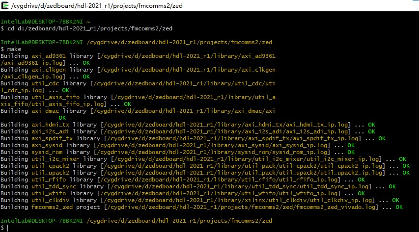
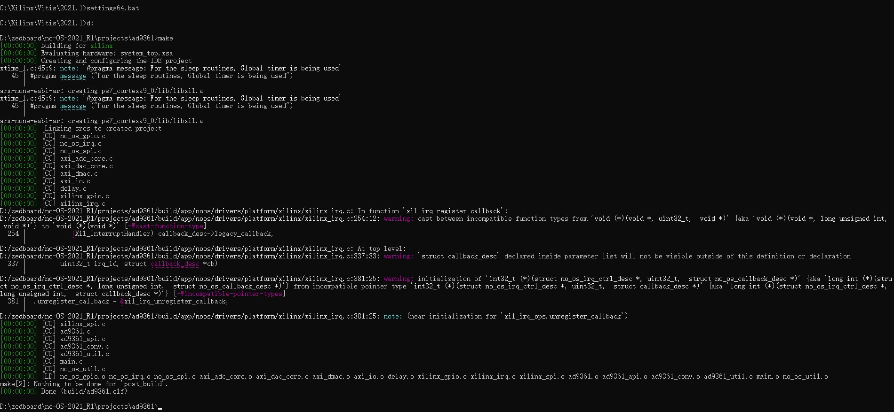
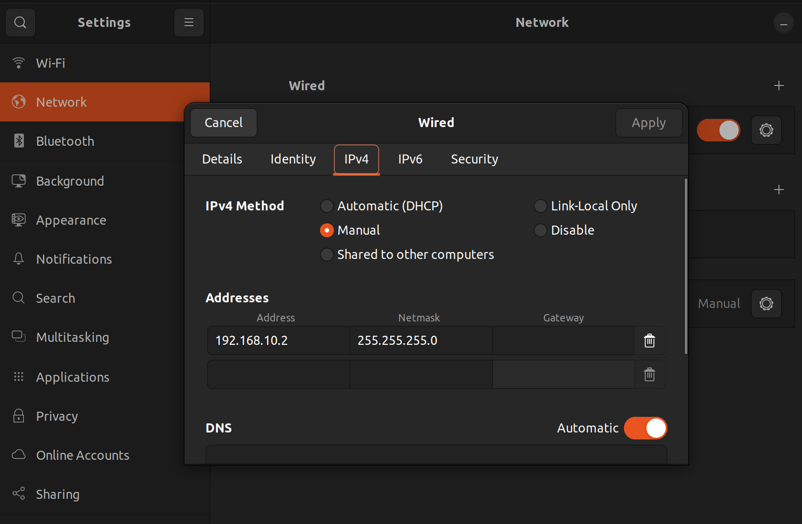
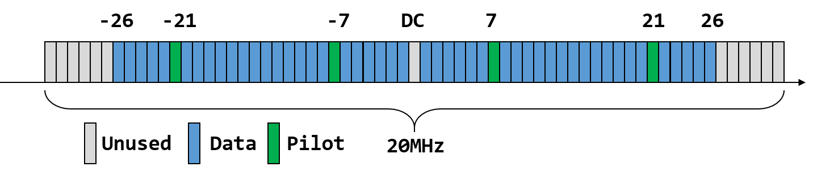

# Zedboard+AD9361 SDR开发日志

## 10/3

配置课题组PMPC-03主机, 数据存于D:\zedboard. 安装potplayer.

启动模式跳线设置(MIO[6:2])：SD(5'B01100), QSPI FLASH(5'B01000), JTAG(5'B00000)

AD9361板卡型号[AD-FMCOMMS3-EBZ](https://wiki.analog.com/resources/eval/user-guides/ad-fmcomms3-ebz)

参考视频：ZED9361发布视频1-3，升级至2018

参考页面：[AD板卡官方文档](https://wiki.analog.com/resources/eval/user-guides/ad-fmcomms3-ebz), [HDL仓库](https://github.com/analogdevicesinc/hdl/tree/master/projects/fmcomms2/zed), [no-OS软件驱动仓库](https://github.com/analogdevicesinc/no-OS/tree/master/projects/fmcadc2)

计划指标：1ms, 1Mbps。计划下一步先跑通最新版no-OS官方代码，之后开发射端分支，优先理解AD板卡驱动。可在基带加速通过PL端实现后用OS实现GUI。

学习DMA(Direct Memory Access)。通过释放内存总线使外部硬件可以不同频率读写内存，同时CPU可执行其他操作。

---

## 10/4

[特性曲线](https://wiki.analog.com/resources/eval/user-guides/ad-fmcomms3-ebz/hardware/card_specification)(LO=Local Oscillator)

[**no-OS软件驱动文档**](https://wiki.analog.com/resources/eval/user-guides/ad-fmcomms2-ebz/software/baremetal)（此文档最后更新于2018, 所用软件开发工具为SDK而非后来推出的Vitis）

Zedboard板卡厂Digilent为NI子公司，为Xilinx合作伙伴。另一板卡厂AVNET也提供了完整的[文档支持](https://www.avnet.com/wps/portal/us/products/avnet-boards/avnet-board-families/zedboard/)。

[AD家的HDL文档1](https://wiki.analog.com/resources/fpga/docs/build#windows_environment_setup), [2](https://wiki.analog.com/resources/fpga/docs/hdl)

AD家的HDL代码仓两年发布一次正式更新，主分支为最新开发版，目前的最新正式版为2021第一版(2021_r1)。由于Vivado版本间不兼容，需使用对应的Vivado版本(2021.1)进行开发。代码仓库中提供了顶层设计代码、IP核代码及tcl脚本。

安装Vivado 2021.1于C:\Xilinx。

## 10/5

学习[GNU Make](https://csdiy.wiki/%E5%BF%85%E5%AD%A6%E5%B7%A5%E5%85%B7/GNU_Make/)。GNU是一套软件集，其名字源自递归缩写等文字游戏（还neta了Unix）。GNU Make可以调用不同的编译器，对源码进行编译或是更新输出文件。虽然Vivado SDK也提供了Tcl脚本支持，但还是不如Make方便高效。

Windows下运行类Unix的GNU Make程序可以选择安装Cygwin，一套在Windows中运行的GNU。

安装Cygwin于C:\cygwin64，安装make和git包。

## 10/6

### 学习AD代码仓提供的项目食用教程

于Cygwin根目录bashrc文件(C:\cygwin64\home\IntelLab)添加环境变量: export PATH=$PATH:/cygdrive/c/Xilinx/Vivado/2021.1/bin:/cygdrive/c/Xilinx/Vitis/2021.1/bin

通过Cygwin，于D:\zedboard\hdl-2021_r1\projects\fmcomms2\zed运行make, 得到.xpr项目文件，在Vivado中打开即可（no-OS开发需要的.xsa文件（即Vivado2019.3前的.hdf文件）位于sdk目录）。

---

发现Vivado默认不包含Vitis, [追加安装Vitis](https://blog.csdn.net/tcjy1000/article/details/126567610).

[driverDoc](http://analogdevicesinc.github.io/no-OS/dir_4ed417a91f9ccc543343a95aa671159a.html)

复制2021_r1源码至D:\zedboard\no-OS-2021_R1. 复制.xsa文件至projects\ad9361目录。

以管理员模式运行cmd, 运行setting64.bat后运行make.

运行make sdkopen在Vitis中打开项目。

## 10/7

尝试在Vivado连接设备，报错。发现是设备中安装了Hyper-V虚拟机所致，参考[此页](https://fpgacoding.com/to-v-or-not-to-v/)解决。执行了以下操作：

> So I disabled Hyper-V in Settings | Apps & Features | Programs and Features | Windows Features.

解决了连接问题。后续如果要用Hyper-V虚拟机需重新启用此项。

---

串口跑不通，新建一个hello world也不行。力不从心，歇了。

## 2/22

烧录linux镜像至SD卡。

https://wiki.analog.com/resources/tools-software/linux-software/zynq_images

根据BOOT盘根目录的readme，将zynq项目所需文件复制至根目录。

## 2/23

点亮系统，等待OTG转接头，学习设计通信参数配置。

## 2/24

测试传输效果，单音及双音收发正常。

## 2/25

测试QPSK。

## 2/26

测试QPSK。samba服务不可用，怀疑是网线直连没有DHCP的原因，等待网线快递。

## 2/27

通过路由器连接至同一局域网依然无法使用samba软件在Windows系统和ZYNQ的Linux系统间传送文件，重新安装samba服务。配置成功，可以通过网络共享文件。

参考页面：https://www.cnblogs.com/shellstudio/p/10756419.html#:~:text=%E5%90%AF%E5%8A%A8%E6%A0%91%E8%8E%93%E6%B4%BE%E4%BB%A5%E5%90%8E%EF%BC%8C%E5%9C%A8%E5%91%BD%E4%BB%A4%E8%A1%8C%E8%BE%93%E5%85%A5%EF%BC%9A%20sudo%20apt%20-get%20update%20sudo%20apt,-get%20install%20samba%20samba%20-%20common%20-%20bin

https://forum.ubuntu.com.cn/viewtopic.php?t=275853

https://www.cnblogs.com/yunmeng-shi/p/16215277.html

生成QPSK数据输入板卡并接收。

## 2/28

测试QPSK，发现IQ两路间存在串扰。起初以为IQ两路基带信号需要正交，但这样QPSK的实现会十分复杂。

向刘博求助后发现可能是收发端载波本振存在相差。调节IIO软件内的接收机相位旋转参数，可以较好地接收NRZ信号。

断电后相差发生变化，需要设计相位同步方法。

## 3/2

设计相差估计算法，IQ均发送1信号，通过接收信号可估计载波相位差φ = arctan((I-Q)/(I+Q))。

学习pyadi和numpy，将matlab程序搬移至python。

查询ADI论坛及Oscilloscope插件源码，发现板内射频本振无法实现硬件相位同步，须通过软件对基带采样值进行矫正。

发现基带存在DC滤波，需发送零均值信号进行相差估计。IQ发送相同信号[1,1,1,-1,-1,1,-1,-1]，设接收机载波相位-发射机载波相位=φ。

## 3/3

平台使用的AD9361射频芯片的接收机本振无法通过硬件实现载波同步，因此需要实现相位差补偿程序来消除载波相位差带来的影响。

对于QPSK信号，其发送信号可表示为$s(t) = I(t)\cos(\omega_Ct)+Q(t)\sin(\omega_Ct)$。而接收信号可以表示为

$$I_R(t) = LPF\{s(t)\cos(\omega_Ct+\phi)\}=I(t)\cos(\phi)-Q(t)\sin(\phi)\\Q_R(t) = LPF\{s(t)\sin(\omega_Ct+\phi)\}=Q(t)\cos(\phi)+I(t)\sin(\phi)$$

其中，φ为接收信号相对于发送信号的载波相位差。

为了实现相位差补偿，首先需要进行相位同步，这里使用训练序列进行同步。可以发送相同的训练序列，由于此时I(t)=Q(t)，因此可以通过计算得到相位差$\phi=\arctan(\frac{Q-I}{Q+I})$。接着，通过以下公式计算出发送信号：

$$I(t) = I_R(t)\cos(\phi)+Q_R(t)\sin(\phi)
\\Q(t) = Q_R(t)\cos(\phi)-I_R(t)\sin(\phi)$$
然而，由于arctan函数以pi为周期，存在相位模糊问题。为了解决这个问题，可以设计特殊的训练序列，例如[1,1,1,0,0,1,0,0]，该序列具有零均值且可用于判断极性。
最后，可以通过实验验证相位差补偿算法的效果，并对算法进行优化和调整。

# 3/22

install [openwifi](https://github.com/open-sdr/openwifi)

set ip(restart the ethernet)

# 3/24

## openofdm notes

(all according to 802.11)

> input: samples\
> output: data

### packet detection

- power trigger
  
    wait for large enough signal samples to avoid fake positive.

- short preamble
  
  use auto correlation to sync package and do freq correction

  (20MHz BW, 18ppm(0.0018%) LO precision->deltaF=90kHz for 5G)

### Frequency offset  correction

- coarse
  
  short preamble

- fine
  
  long preamble(omitted)

- pilot

  user pilot symbol in each OFDM frame to correct SFO(sample freq offset)

### symbol alignment

- In 802.11, each OFDM symbol is 4 μs long. At 20 MSPS sampling rate, this means each OFDM symbol contains 80 samples. The task is to group the incoming streaming of samples into 80-sample OFDM symbols. This can be achieved using the long preamble following the short preamble.

  

- FFT

  Xilinx IP core.(64 data symbol per OFDM symbol)

### equailization

- use pilot symbol to equalize channel fading.

### decoding

- demod

  QAM to bits

- demodulation
  
  complex number to bits
    
- deinterleaving
  
  shuffle the bits inside each OFDM symbol
    
- Convolution decoding

  remove redundancy and correct potential bit errors
    
- Descramble.

### SIGNAL

- the first OFDM symbol after long preamble is the SIGNAL field, which contains the modulation rate and length of the packet. These information are needed to determine how many OFDM symbols to decode and how to decode them.

### Verilog Hacks

- Because of the limited capability of FPGA computation, compromises often need to made in the actual Verilog implementation. The most used techniques include quantization and look up table. In OpenOFDM, these approximations are used.

For example, the magnitude of complex number <I, Q> is estimated as:
$$M \approx \alpha*max(|I|, |Q|) + \beta*min(|I|, |Q|)$$
and we set alpha = 1 beta = 0.25 so that only simple bit-shift is needed.
